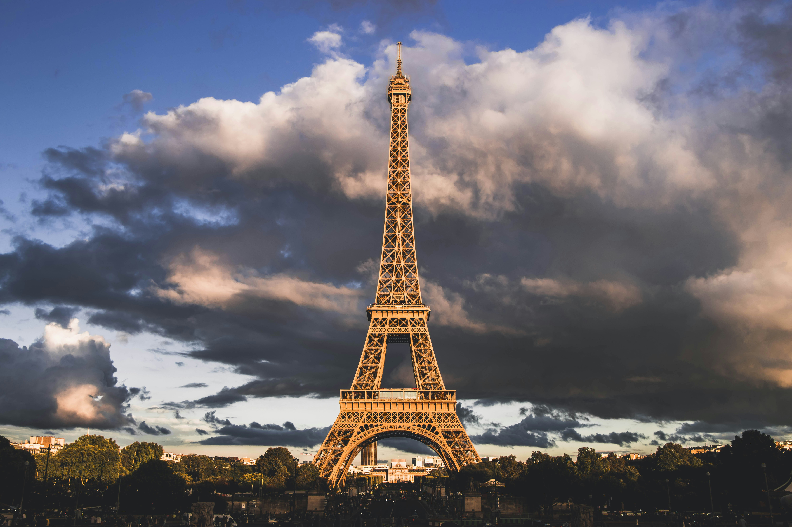
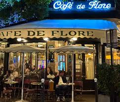
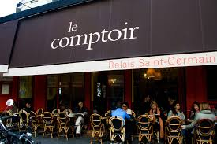
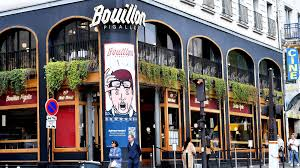
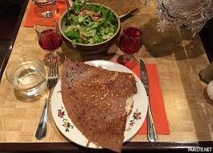
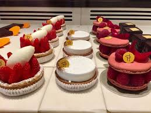
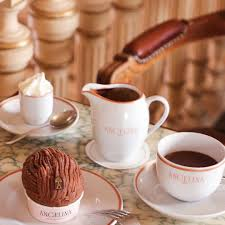
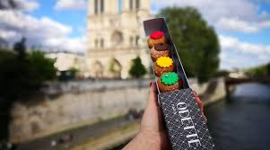

# ¿Qué haremos en Disney?

Lo primero disfrutar como niños y lo segundo comprarnos unas orejas

## Nuestro itinerario

| Día               | Actividades                                                                                           |
|-------------------|------------------------------------------------------------------------------------------------------|
| 13 de Noviembre   | Llegada al Hotel Juliette y visita a Paris con freetour 🎄                       |
| 14 de Noviembre   | Parque Disneyland y el Parque Walt Disney Studios 🎡                                                |
| 15 de Noviembre   | Parque Disneyland y el Parque Walt Disney Studios   🎡                                                                     |
| 16 de Noviembre   | Vuelta y día libre                                                                    |

## Lugar Imperdibles

### 1. Merienda en París  
📍 **Cómo llegar**: Desde nuestro alojamiento, tomaremos el metro hasta **Trocadéro** (línea 6 o 9) para unas vistas espectaculares de la Torre Eiffel.  
🎟️ *Entrada*: [Aquí tienes el plan chulo ;)](https://www.toureiffel.paris/es)  
🗼 **Qué vamos a hacer**: Sacarnos fotos preciosas con la Torre Eiffel, tomar un chocolate caliente con vista y caminar de la mano por el Champ de Mars.  
 <!-- Aquí puedes poner tu propia foto -->

---

### 2. Marché de Noël en los Campos Elíseos  
📍 **Cómo llegar**: Metro línea 1 hasta **Champs-Élysées – Clemenceau**.  
🎄 **Qué hacer**: Recorrer los puestecitos navideños, probar vino caliente, comprar regalitos y disfrutar del espíritu navideño con luces por todos lados.  
 <!-- Aquí puedes poner tu propia foto -->

---

### 3. Montmartre y Sacré-Cœur al atardecer  
📍 **Cómo llegar**: Metro línea 2 hasta **Anvers**, luego subir a pie o en funicular.  
🎨 **Qué hacer**: Perdernos por las calles bohemias, ver retratos en la Place du Tertre, entrar a la basílica y mirar cómo se encienden las luces de París desde arriba.  
 <!-- Aquí puedes poner tu propia foto -->

---

## 🗺️ Lugares Imperdibles en París

- **Torre Eiffel** iluminada por la noche, ¡pide un deseo!  
- **Notre-Dame y la Sainte-Chapelle**, pura historia.  
- **Jardines de Luxemburgo**, para pasear entre hojas de otoño.  
- **Galeries Lafayette** con sus decoraciones navideñas.  
- **Puente Alexandre III**, el más bonito de París.

---

## 🍽️ Recomendaciones Culinarias

París también se come con amor:

- **Café de Flore** ☕: Desayuno clásico parisino con croissant y chocolat chaud.  
   <!-- Foto sugerida -->

- **Le Comptoir du Relais** 🍷: Bistró delicioso para un almuerzo con sabor francés.  
  

- **Bouillon Pigalle** 🥘: Cena parisina rica, tradicional y sin romper el bolsillo.  
  

- **Crêperie Josselin** 🥞: Crêpes dulces o saladas para cerrar el día.  
  

---

## 🍰 Dulces Tentaciones

- **Pierre Hermé** o **Ladurée** para probar los mejores macarons del mundo.  
  

- **Angelina Paris** ☕: Famoso por su chocolate caliente espeso y su Mont-Blanc.  
  

- **Odette Paris**: Pequeños pastelitos choux con vista a Notre-Dame.  
  

---

## Estoy super orgulloso de nosotros, de verdad te quiero mucho ❤️‍🩹

> "Va a ser la mejor navidad juntitos" 💑
